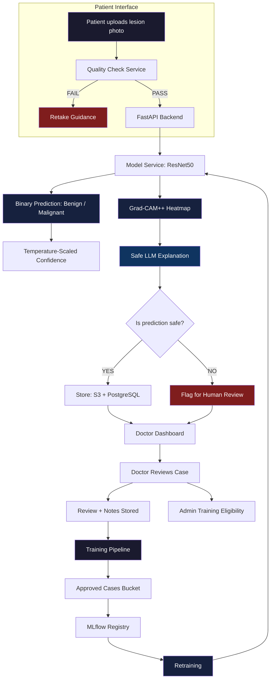
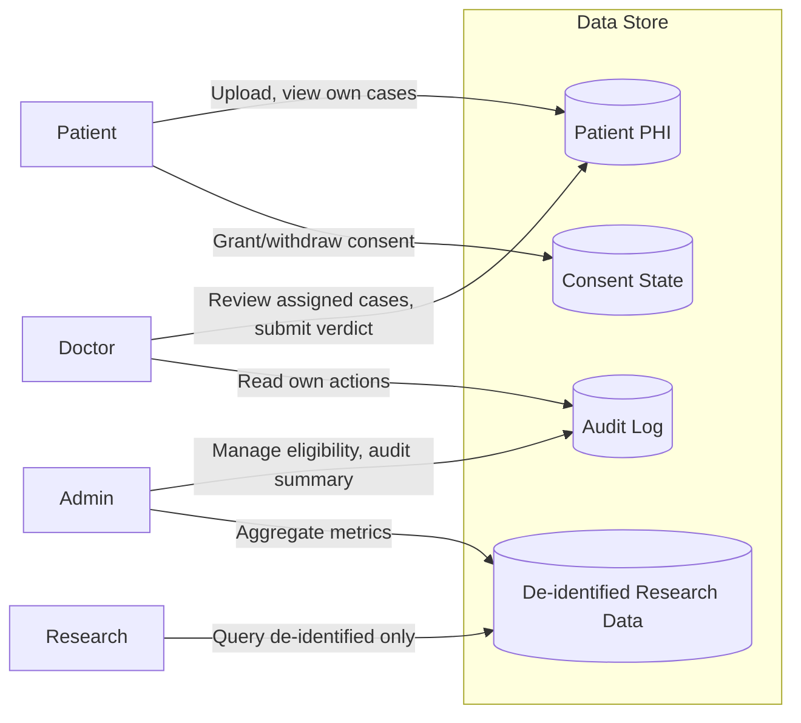

# Architecture Overview

This is the single document that shows how everything connects. Start here before reading any guide.

---

## System Flow

What this Mermaid diagram does:

- `flowchart TD` creates a top-to-bottom system flow diagram.
- `subgraph Patient_Interface["Patient Interface"]` groups the patient-facing upload and quality-check steps.
- `A[Patient uploads lesion photo] --> B[Quality Check Service]` shows the patient image entering a quality-check step before analysis.
- `B -->|FAIL| D[Retake Guidance]` shows that bad-quality images should produce retake guidance, not an AI result.
- `B -->|PASS| E[FastAPI Backend]` shows that only acceptable images move to the backend.
- `E --> F[Model Service: ResNet50]` routes backend analysis to the model service.
- `F --> G[Binary Prediction: Benign / Malignant]` shows the classification output.
- `F --> H[Grad-CAM++ Heatmap]` shows the explainability output.
- `G --> I[Temperature-Scaled Confidence]` means raw model output must be calibrated before display.
- `H --> J[Safe LLM Explanation]` means the heatmap is turned into patient-safe language through controlled explanation logic.
- `K{Is prediction safe?}` is a decision node. Safe predictions are stored; unsafe ones are flagged for review.
- `L[Store: S3 + PostgreSQL]` separates file storage (S3) from state/metadata storage (PostgreSQL).
- `N[Doctor Dashboard]` and later nodes show human review and training eligibility.
- `R --> S --> T --> U --> F` shows the approved-data retraining loop back into the model service.
- The `style` lines color important nodes so risks and core ML steps stand out visually.

---

## Data Flow Description

1. **Image Upload** -- Patient uploads via Next.js frontend. Image is validated for format and minimum dimensions before passing to backend.

2. **Quality Check** -- FastAPI receives image, runs quality checks (blur detection, exposure, frame presence). If quality is too low, patient gets retake guidance instead of analysis.

3. **Inference** -- ResNet50 model (loaded from `models/skin_lesion_classifier.pth`) outputs a raw logit. Temperature scaling converts logit to calibrated confidence.

4. **Grad-CAM++** -- Heatmap generated targeting `layer4[-1]` on ResNet50. Overlay is base64-encoded PNG.

5. **LLM Explanation** -- Structured facts (label, confidence, heatmap regions) are passed to GPT-4o-mini via the safe explanation endpoint. Refusal patterns block any diagnosis language.

6. **Storage** -- Original image (or de-identified copy for research), prediction, heatmap, and LLM output stored in S3 + PostgreSQL. Consent state machine determines retention and access.

7. **Doctor Review** -- Doctor dashboard shows queue of cases. Doctor verifies body map location, reviews Grad-CAM heatmap, and submits verdict.

8. **Training Pipeline** -- Only doctor-approved, consent-granted cases enter the training bucket. SQS event triggers MLflow model registry promotion workflow.

---

## Role Access Boundaries

What this Mermaid diagram does:

- `flowchart LR` creates a left-to-right access-boundary diagram.
- `subgraph Data_Store["Data Store"]` groups the major data categories.
- `PHI[(Patient PHI)]`, `CONSENT[(Consent State)]`, `AUDIT[(Audit Log)]`, and `RESEARCH[(De-identified Research Data)]` are database-style nodes.
- Patient arrows show that patients can upload/view their own PHI and grant/withdraw consent.
- Doctor arrows show that doctors access assigned PHI and their own audit-related actions.
- Admin arrows show audit and aggregate metric access, not raw patient data by default.
- Research arrows show access only to de-identified research data.
- The diagram is a boundary model: if later code allows a role to cross these arrows, the design is broken.

### Role Definitions

| Role | Data they can see | Actions |
|------|------------------|---------|
| Patient/User | Own images, predictions, heatmaps, consent | Upload, view, withdraw consent |
| Doctor | Assigned patient cases, body map, lab notes | Review, verdict, flag |
| Admin | Audit logs, training queue, system metrics | Approve training eligibility |
| Research Reviewer | De-identified, k-anonymised dataset | Query fairness metrics |
| Customer | Aggregated dashboard, own history | View reports, reminders |

### Data Access Matrix

| Resource | Patient | Doctor | Admin | Research |
|----------|---------|--------|-------|----------|
| Own images | RW | - | - | - |
| Assigned patient images | - | R | - | - |
| De-identified images | - | - | - | R |
| Consent state | RW (own) | R | R | R |
| Doctor notes | - | RW (own) | - | - |
| Training queue | - | - | RW | - |
| Audit log | - | R (own) | R | - |

---

## Technical Stack

| Layer | Technology | Purpose |
|-------|------------|---------|
| Frontend | Next.js 14 | Upload UI, dashboards, body maps |
| API | FastAPI | REST endpoints, async workers |
| Model inference | PyTorch ResNet50 | Binary classification |
| Explainability | pytorch-grad-cam (GradCAM++) | Heatmap generation |
| LLM | GPT-4o-mini (OpenAI) | Safe explanation generation |
| Database | PostgreSQL / Aurora DSQL | State, consent, audit |
| Storage | AWS S3 | Image files, model artifacts |
| Cache | Redis / ElastiCache | Session, short-lived cache |
| Task queue | Celery + SQS / EventBridge | Async training pipeline |
| Container | Docker + Kubernetes (EKS) | Runtime |
| IaC | Terraform | AWS resource provisioning |
| Observability | CloudWatch + structured logs | RED/USE metrics |
| ML tracking | MLflow | Experiment registry, model cards |

---

## Key Architectural Decisions

1. **End-to-end CNN + Grad-CAM, NOT frozen backbone + XGBoost** -- Gradient-based explainability requires end-to-end differentiability. XGBoost head is incompatible with Grad-CAM (gap #21 closed).

2. **Grad-CAM on separate endpoint from prediction** -- Prediction returns immediately; heatmap loads asynchronously. Patients should not wait 2-3s for heatmap generation.

3. **LLM explanation from structured facts, not raw model output** -- The explanation is generated from a structured payload (label, confidence bands, heatmap regions) not from raw model logits. This makes the explanation auditable and safe.

4. **Consent state machine before any training use** -- No patient data enters the training pipeline without explicit consent state = APPROVED. This is enforced at the database layer, not just the API.

5. **Role-based RAG isolation** -- Patient education, doctor workflow, admin market research, and customer support each have separate vector indexes. Cross-index leakage is prevented by design (see product/13_LLM_RAG_AGENT_BOUNDARIES_HANDHOLDING.md).

---

## Regulatory Context

This project frames itself as an **educational AI-supported tool, not a diagnostic device**. This framing affects:

- No claim of melanoma detection or diagnosis
- No 510(k) submission required (educational tool exemption)
- Clinical validation is academic, not regulatory
- No HIPAA BAA required (portfolio project)

If this project were to become a real clinical tool: FDA SaMD Class II 510(k) pathway, QMS, clinical evidence, and post-market surveillance would be required. See 02_ULTIMATE_PRODUCTION_GUIDE.md Section 8.

---

## Cost Pause / Resume

This guide does not create cloud resources. No pause needed.
